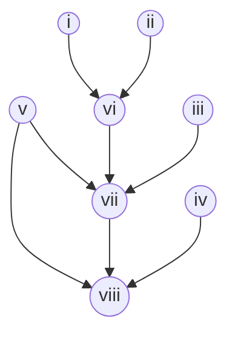

# Heading 1
## Heading 2
### Heading 3
#### Heading 4
##### Heading 5
###### Heading 6

**Bolded**
_Italicized_
~~Strikethrough~~
==Highlighted==

- Bulleted lists look like this
	- Indents look like this
		- Or like this
			- or like this

- [ ] check boxes can be empty
- [x]  they can be crossed out
- [f] they can be filled 
- [>] there are many more symbols you can try 
![[010 Meta/011 Attachments/f6ca179e738e8794d80509806ea889baa3aeea91.png]]

- External links look [like this](google.com)
- Internal links look [[010 Meta/Formatting test\|like this]]
- Broken links look [[like this]]
- Obsidian tags look #like/this

| Column 1  | Column 2  | Column 3  |
| --------- | --------- | --------- |
| Text data | Text data | Text data |
| Text data | Text data | Text data |

Inline math can be written $like\; this\space with \; symbols \; \delta$
Inline code can be written `like this with functions`
Normal text can include emojis like 🥰🚀🥝
Formatting lines can be added like this:

****

> [!system]
> This is a callout, which can contain any kind of markdown information like [links](). 

```python
codeblocks = this(appearence)
#Code blocks like ```dataview and ```dataviewjs will execute and not remain visible
```


$$
\begin{matrix}
This\;is\;what\;chemistry\;looks\;like:\\
\ce{UF6^{gas} + 2H2O^{gas} → UO2F2^{solid} + 4HF}\\
\ce{UO2F2^{solid} + H2^{gas} → UO2^{solid} + 2HF}\\
\end{matrix}
$$

$$
\begin{matrix}
this\;is\;what\;a \;math\;block\;looks\;like:\\
a^2 + b^2 = c^2 \\
\Delta G_{binding} = \Delta G_{complex}-(\Delta G_{receptor} - \Delta G_{ligand}) 
\end{matrix}
$$




Here is a factual statement. It can be cited using a footnote [^1] 

[^1]: This is the citation. It could be plain, ==formatted==, or a [[link]]
